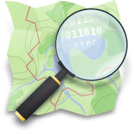
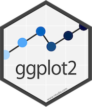
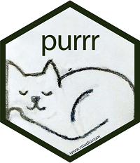
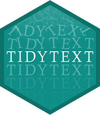
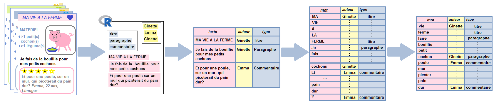

# Introduction {#intro}

```{r setup, include=FALSE}
knitr::opts_chunk$set(echo = TRUE, warning=FALSE, message=FALSE)
library(tidyverse)
library(purrr)
library(rvest)
library(tidytext)
library(proustr)
library(stringr)
```

## De la donnée textuelle "brute"... comme quoi?

Donnée textuelle en langage "contraint":

- **adresses**
- **noms**
- **chemins de fichiers**, **liens**
- etc.

Donnée textuelle en "langage naturel":

- **oeuvres littéraires**
- **enquêtes**, **entretiens**
- **journaux**
- **sites web**
- données **réseaux sociaux** (Twitter, Facebook, etc.)
etc.

## Import dans R de données textuelles

**Du texte sur support physique au  texte numérisé**

- **transcription** d'un enregistrement audio en un **texte sur support numérique** (Speech Recognition API, HP IDOL : API client [transcribeR](https://cran.r-project.org/web/packages/transcribeR/vignettes/Transcribing_audio_with_transcribeR.html))
- OCRisation de l'**image (numérique)** du support au **texte sur support numérique** (Tesseract OCR engine in R [vignette](https://cran.r-project.org/web/packages/tesseract/vignettes/intro.html)


**Du support numérisé à R**

- import de **tables**
- import de **corpus** (notamment, si traitement par ailleurs par des logiciels dédiés)
- interrogation d'**APIs**
- **web-scraping**


## APIs


Recueil de données de certains **sites ou réseaux sociaux** via les **APIs** + **APIs clients**...


**Recueillir de la donnée textuelle**:

-  Wikipedia => package **wikipediR**

-   Twitter => **rtweet**


**Traiter de la donnée textuelle**:

-  Google Translate => package **googleLanguageR**
-  => géocodage via OpenStreetMap => package **ggmap**

## Parti pris

Travailler (si possible) avec les packages de l'univers "tidyverse":

- `dplyr`: manip de tableaux
- `ggplot2`: graphiques
- `stringr`: strings
- `purrr`: itération
- `rvest`: web scraping
- `tidytext`+`widyr`: langage naturel
- `proustr`: langage naturel en français
- `ggraph`: graphes

J'ai aussi rassemblé **quelques fonctions utiles pour l'analyse de données textuelles dans un package `mixr`**, [disponible en ligne sous forme d'un repo gitHub](https://github.com/lvaudor/mixr).

Pour l'installation, on utilise une fonction `install_github()` disponible dans le package `devtools` (vous aurez peut-être besoin d'installer ce package devtools au préalable si vous ne l'avez pas déjà fait):

```{r install mixr, eval=FALSE}
devtools::install_github("lvaudor/mixr")
```


**Exceptions à l'usage des packages du tidyverse ou tidyverse-friendly**:

- `wordcloud`: nuages de mots
- `textometry`: specificités

J'utiliserai dans cet ouvrage une large variété de packages aussi essaierai-je, autant que possible, de **préciser explicitement de quel package provient chaque fonction**, c'est-à-dire que j'appellerai les fonctions en faisant `nompackage::nomfonction()` plutôt que simplement `nomfonction()`.


<!-- # APIs vs scraping -->

<!-- Les APIs: -->

<!-- **Avantages** :  -->

<!-- - **facilité** de récupération de la donnée -->
<!-- - donnée déjà **structurée** pour réutilisation ultérieure -->
<!-- - donnée déjà **tabulaire** (parfois) (exemple rtweet) -->

<!-- **Inconvénient** :  -->

<!-- - n'existent pas forcément -->
<!-- - nécessité de créer une clé -->
<!-- - données récupérables **limitées** (quantité et nature) -->
<!-- - **nombre de requêtes limité** pour une période donnée. -->


<!-- # Remarques  -->

<!--  -->

<!-- problèmes d'encodage -->
<!-- (https://cran.r-project.org/web/views/NaturalLanguageProcessing.html) -->

