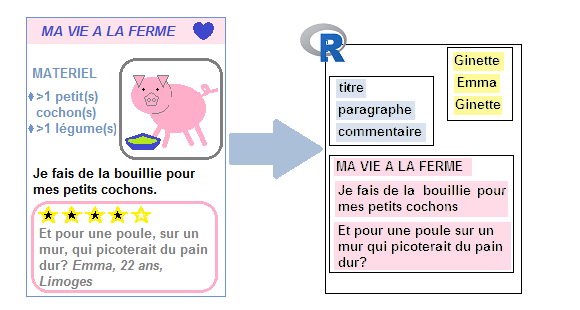
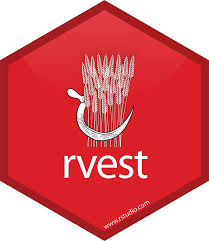
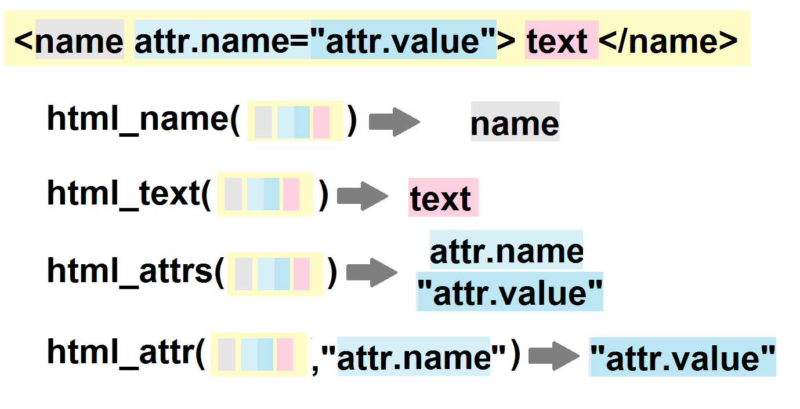
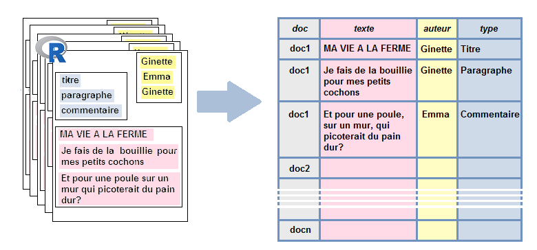
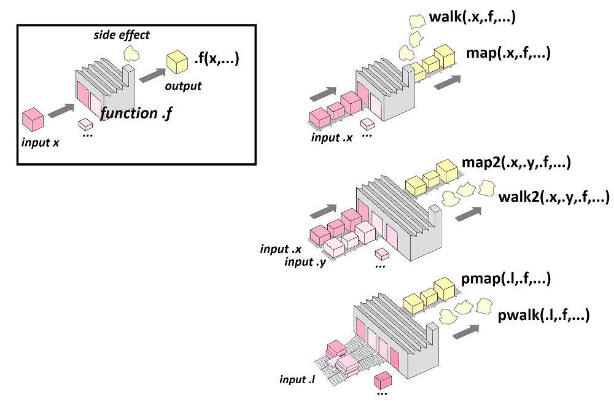

# Extraction de données textuelles par web scraping

**Principe**: récupérer la donnée (notamment textuelle) présente sur des pages web. 

Le plus souvent, il s'agit de récupérer des données sur une **série de pages** qui sont toutes organisées de la même manière (par exemple, données issues de pages de recette sur Marmiton, données issues de petites annonces sur Leboncoin, données correspondant à l'ensemble des équipes ou des joueurs sur un site sportif, etc.)

```{r setup, include=FALSE}
knitr::opts_chunk$set(echo = TRUE, warning=FALSE, message=FALSE)
library(tidyverse)
library(purrr)
library(rvest)
library(tidytext)
library(proustr)
library(stringr)
```




Utilisation du package **rvest**
 

Pour **récolter le contenu textuel d'une page web**, il faut être en mesure de:

- **lire une page html** dans R
- **repérer l'élément d'intérêt** dans la page (connaissance basique du html, [SelectorGadget](https://cran.r-project.org/web/packages/rvest/vignettes/selectorgadget.html))
- **parcourir l'arborescence** de la page
- **sélectionner un élément** de la page
- **récupérer le contenu** de l'élément


## Langage html

Le langage html est consitué de **balises** qui permettent de **mettre en forme le contenu statique d'une page web**.

Considérons ainsi cette page web, toute simple (ici encapsulée dans ce document):

<iframe src='data/blog_de_ginette.htm' width='500' height='600'></iframe>

Le code html correspondant à cette page est le suivant:

    <html>
    <style>
    h1 {background-color: powderblue;}
    .image {margin-left:50%;}
    .comment{border-style:solid; background-color:LemonChiffon;}
    .comment-author{font-style: italic;}
    </style>
    <h1> MA VIE A LA FERME </h1>
    <div class="ingredients">
      <b> INGREDIENTS</b>
      <ul>
        <li> >1 cochon(s) </li>
        <li> >1 légume(s) </li>
      </ul>
    </div>
    <div class="right"><div class="image">
    <p> Je fais de la bouillie pour mes petits cochons.</p>
    <p> Pour un cochon, pour deux cochons, pour trois cochons, pour quatre, puis pour cinq, pour six, pour sept, pour huit, pour neuf, boeuf! </p>
    <b>Commentaires</b>
    </div>
    </div>
    <div class="comment">Et pour une poule sur un mur qui picoterait du pain dur?</div>
    <div class="comment-author">Emma, 22 ans, Limoges</div>
    <div class="comment">Je vois que vous êtes, telle la petite poule rousse, bien aimable. Avez-vous pu compter sur l'aide du chat et du canard pour semer vos 5 grains de blé?</div>
    <div class="comment-author">Michel, 56 ans, Rennes</div>
    </html>

## Lire une page html

Lire la page html dans R: on obtient 

```{r}
library(rvest)
html=xml2::read_html("data/blog_de_ginette.htm", encoding="UTF-8")
html
```


## Extraire certains éléments d'une page html

**Extraire** certains éléments (des "nodes" ou "nodesets"):

```{r}
rvest::html_nodes(html,"b")
rvest::html_nodes(html,".comment-author") 
rvest::html_nodes(html,".ingredients") %>% 
  rvest::html_children()
```


### Extraire le type de certains éléments



**Extraire le type** des nodes ou nodesets:

```{r}
rvest::html_nodes(html,".image") %>% 
  rvest::html_name()
```


### Extraire le contenu de certains éléments


**Extraire le contenu** des nodes ou nodesets:

```{r}
rvest::html_nodes(html,"b") %>% 
  rvest::html_text() 
```

### Extraire les attributs de certains éléments


**Extraire les attributs** des nodes ou nodesets:

```{r}
rvest::html_nodes(html,"div") %>% 
  rvest::html_attrs()
```


## Passage au format rectangulaire, et mise en fonction



On extrait les données et on les met sous forme de table:

```{r}
page <- "data/blog_de_ginette.htm"
html <- xml2::read_html(page, encoding="UTF-8")
texte <- html %>%
  rvest::html_nodes(".comment") %>%
  html_text()
auteur <- html %>%
  rvest::html_nodes(".comment-author") %>%
  html_text()
tib_commentaires <- tibble::tibble(texte,auteur)
tib_commentaires
```

On peut en fait écrire une fonction qui prendrait pour entrée l'url de la page considérée et nous renverrait ce même tableau en sortie:

```{r}
extrait_commentaires <- function(page){
  html <- xml2::read_html(page, encoding="UTF-8")
  texte <- html %>%
    rvest::html_nodes(".comment") %>%
    html_text()
  auteur <- html %>%
    rvest::html_nodes(".comment-author") %>%
    html_text()
  tib_commentaires <- tibble::tibble(doc=rep(page,length(texte)),
                                     texte,
                                     auteur)
  return(tib_commentaires)
}

extrait_commentaires("data/blog_de_ginette.htm")
extrait_commentaires("data/blog_de_jean-marc.htm")
```

## Itération 


Imaginons maintenant qu'on ne traite pas seulement du blog de Ginette, mais aussi de tout un tas d'autres pages **structurées de la même façon**.

Ici, on va supposer simplement qu'on a 3 pages structurées de la même manière:

<iframe src='data/blog_de_ginette.htm' width='500' height='600'></iframe>

<iframe src='data/blog_de_jean-marc.htm' width='500' height='600'></iframe>

<iframe src='data/blog_de_norbert.htm' width='500' height='600'></iframe>

On dispose maintenant de la fonction `extrait_commentaires()` qui prend pour entrée le nom de la page html, et renvoie en sortie un tableau relatif aux commentaires sur la page. On voudrait appliquer cette fonction, de manière **itérative** à l'ensemble des pages html qui nous intéressent.

Le package `purrr` permet d'**appliquer une fonction** à différents éléments d'une liste ou d'un vecteur, de manière **itérative** (...il est évidemment possible de réaliser la même opération à l'aide d'une boucle `for`...).



```{r}
pages=c("data/blog_de_ginette.htm",
        "data/blog_de_jean-marc.htm",
        "data/blog_de_norbert.htm")

list_commentaires <- purrr::map(pages, extrait_commentaires)
list_commentaires
```

```{r}
tibtot_commentaires <- list_commentaires %>%
  dplyr::bind_rows()
tibtot_commentaires
```

```{r, echo=FALSE}
readr::write_csv(tibtot_commentaires,
                 "data/tibtot_commentaires.csv")
```

