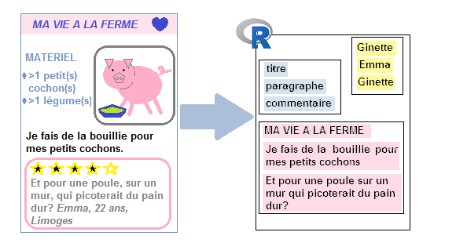

# Extraction de données textuelles

## Depuis des pages web: web-scraping

**Principe**: récupérer la donnée (notamment textuelle) présente sur des pages web. 

Le plus souvent, il s'agit de récupérer des données sur une **série de pages** qui sont toutes organisées de la même manière (par exemple, données issues de pages de recette sur Marmiton, données issues de petites annonces sur Leboncoin, données correspondant à l'ensemble des équipes ou des joueurs sur un site sportif, etc.).




Utilisation du package **rvest**
 

Pour **récolter le contenu textuel d'une page web**, il faut être en mesure de:

- **lire une page html** dans R
- **repérer l'élément d'intérêt** dans la page (connaissance basique du html, [SelectorGadget](https://cran.r-project.org/web/packages/rvest/vignettes/selectorgadget.html))
- **parcourir l'arborescence** de la page
- **sélectionner un élément** de la page
- **récupérer le contenu** de l'élément


### Langage html

Le langage html est consitué de **balises** qui permettent de **mettre en forme le contenu statique d'une page web**.

Considérons ainsi cette page web, toute simple (ici encapsulée dans ce document):

<iframe src='data/blog_de_ginette.htm' width='500' height='600'></iframe>

Le code html correspondant à cette page est le suivant:

    <html>
    <style>
    h1 {background-color: powderblue;}
    .image {margin-left:50%;}
    .comment{border-style:solid; background-color:LemonChiffon;}
    .comment-author{font-style: italic;}
    </style>
    <h1> MA VIE A LA FERME </h1>
    <div class="ingredients">
      <b> INGREDIENTS</b>
      <ul>
        <li> >1 cochon(s) </li>
        <li> >1 légume(s) </li>
      </ul>
    </div>
    <div class="right"><div class="image">
    <p> Je fais de la bouillie pour mes petits cochons.</p>
    <p> Pour un cochon, pour deux cochons, pour trois cochons, pour quatre, puis pour cinq, pour six, pour sept, pour huit, pour neuf, boeuf! </p>
    <b>Commentaires</b>
    </div>
    </div>
    <div class="comment">Et pour une poule sur un mur qui picoterait du pain dur?</div>
    <div class="comment-author">Emma, 22 ans, Limoges</div>
    <div class="comment">Je vois que vous êtes, telle la petite poule rousse, bien aimable. Avez-vous pu compter sur l'aide du chat et du canard pour semer vos 5 grains de blé?</div>
    <div class="comment-author">Michel, 56 ans, Rennes</div>
    </html>

### Lire une page html

Lire la page html dans R: on obtient 

```{r}
library(rvest)
html=xml2::read_html("data/blog_de_ginette.htm", encoding="UTF-8")
html
```


### Extraire certains éléments d'une page html

**Extraire** certains éléments (des "nodes" ou "nodesets"):

```{r}
rvest::html_nodes(html,"b")
rvest::html_nodes(html,".comment-author") 
rvest::html_nodes(html,".ingredients") %>% 
  rvest::html_children()
```


#### Extraire le type de certains éléments


**Extraire le type** des nodes ou nodesets:

```{r}
rvest::html_nodes(html,".image") %>% 
  rvest::html_name()
```


#### Extraire le contenu de certains éléments


**Extraire le contenu** des nodes ou nodesets:

```{r}
rvest::html_nodes(html,"b") %>% 
  rvest::html_text() 
```

#### Extraire les attributs de certains éléments


**Extraire les attributs** des nodes ou nodesets:

```{r}
rvest::html_nodes(html,"div") %>% 
  rvest::html_attrs()
```


### Passage au format rectangulaire, et mise en fonction


On extrait les données et on les met sous forme de table:

```{r}
page <- "data/blog_de_ginette.htm"
html <- xml2::read_html(page, encoding="UTF-8")
texte <- html %>%
  rvest::html_nodes(".comment") %>%
  html_text()
auteur <- html %>%
  rvest::html_nodes(".comment-author") %>%
  html_text()
tib_commentaires <- tibble::tibble(texte,auteur)
tib_commentaires
```

On peut en fait écrire une fonction qui prendrait pour entrée l'url de la page considérée et nous renverrait ce même tableau en sortie:

```{r}
extrait_commentaires <- function(page){
  html <- xml2::read_html(page, encoding="UTF-8")
  texte <- html %>%
    rvest::html_nodes(".comment") %>%
    html_text()
  auteur <- html %>%
    rvest::html_nodes(".comment-author") %>%
    html_text()
  tib_commentaires <- tibble::tibble(doc=rep(page,length(texte)),
                                     texte,
                                     auteur)
  return(tib_commentaires)
}

extrait_commentaires("data/blog_de_ginette.htm")
extrait_commentaires("data/blog_de_jean-marc.htm")
```

### Itération 


Imaginons maintenant qu'on ne traite pas seulement du blog de Ginette, mais aussi de tout un tas d'autres pages **structurées de la même façon**.

Ici, on va supposer simplement qu'on a 3 pages structurées de la même manière:

<iframe src='data/blog_de_ginette.htm' width='500' height='600'></iframe>

<iframe src='data/blog_de_jean-marc.htm' width='500' height='600'></iframe>

<iframe src='data/blog_de_norbert.htm' width='500' height='600'></iframe>

On dispose maintenant de la fonction `extrait_commentaires()` qui prend pour entrée le nom de la page html, et renvoie en sortie un tableau relatif aux commentaires sur la page. On voudrait appliquer cette fonction, de manière **itérative** à l'ensemble des pages html qui nous intéressent.

Le package `purrr` permet d'**appliquer une fonction** à différents éléments d'une liste ou d'un vecteur, de manière **itérative** (...il est évidemment possible de réaliser la même opération à l'aide d'une boucle `for`...).


```{r}
pages=c("data/blog_de_ginette.htm",
        "data/blog_de_jean-marc.htm",
        "data/blog_de_norbert.htm")

list_commentaires <- purrr::map(pages, extrait_commentaires)
list_commentaires
```

```{r}
tibtot_commentaires <- list_commentaires %>%
  dplyr::bind_rows()
tibtot_commentaires
```

```{r, echo=FALSE}
readr::write_csv(tibtot_commentaires,
                 "data/tibtot_commentaires.csv")
```


## Depuis des images ou des documents pdf: OCRisation

L'**OCRisation**  (OCR pour **O**ptical **C**haracter **R**ecognition) consiste à **appliquer des algorithmes de reconnaissance de caractères à des images afin d'en extraire du texte**. 

Avec R, on peut réaliser l'OCRisation à l'aide du package `tesseract`, documenté [à cette adresse](https://cran.r-project.org/web/packages/tesseract/vignettes/intro.html). Ce package repose lui-même sur (je vous le donne en mille) le logiciel Tesseract.

```{r load_tesseract}
library(tesseract)
```

Outre l'installation "classique" du package R, donc (via `install.packages("tesseract")` il peut être nécessaire de procéder "à la main" à des installations supplémentaires sur votre machine (ce sera notamment le cas si vous travaillez sous Debian/Ubuntu). Dans ce cas, je vous invite à suivre les indications sur [cette page](https://github.com/ropensci/tesseract).

En outre, pour une reconnaissance optimale des caractères, il est préférable de disposer d'un **moteur d'OCR** qui corresponde à la **langue** du texte que l'on cherche à reconnaître. Pour des langues autres que l'anglais ("eng"), il faudra donc compléter le package `tesseract` en téléchargeant le moteur adéquat. Il n'est nécessaire de réaliser ce téléchargement qu'**une seule fois**. 

Pour les **utilisateurs de Windows/MacOS**, il suffira vraisembablement de faire (ici pour le français):

```{r dl_OCR_engine_Fra, eval=FALSE}
tesseract_download("fra")
```


Pour les **utilisateurs de Debian/Ubuntu**, il peut être nécessaire au préalable pour procéder à ce téléchargement de renseigner (une seule fois!) une variable d'environnement globale TESSDATA_PREFIX en procédant comme suit:

- Ouvrir le fichier .Renviron 

```{r save_global_var_2, eval=FALSE}
usethis::edit_r_environ()
```

- y renseigner le chemin vers le dossier tessdata. Chez moi, il s'agit du chemin "/usr/share/tesseract-ocr/4.00/tessdata/", donc: 

```{r set_TESSDATA_PREFIX, eval=FALSE}
TESSDATA_PREFIX="/usr/share/tesseract-ocr/4.00/tessdata/"
```

Puis:

```{r dl_OCR_engine_Fra_Ubuntu, eval=FALSE}
tesseract_download("fra",datapath="/usr/share/tesseract-ocr/4.00/tessdata/")

```

### Utilisation du package `tesseract`


Considérons par exemple l'image suivante (scannée depuis un numéro Hors-Série de Géo sur les chats du monde...): 

 

Réalisons maintenant l'OCRisation à l'aide de la fonction `ocr()`:

```{r OCR_texte_brut}
texte_brut <- tesseract::ocr("images/chats_de_Paris.png",
                             engine = tesseract::tesseract("fra"))
texte_brut
```

On obtient d'ores-et-déjà un résultat intéressant, malgré quelques petites choses à nettoyer (notamment les retours à la ligne et tirets associés). Pour réaliser ce nettoyage, on peut utiliser les fonctions du package `stringr` et les expressions régulières qui font l'objet du chapitre \@ref(strings)


```{r OCR_texte_clean,tidy.opts=list(width.cutoff=60), message=FALSE, warning=FALSE}
library(dplyr)

txt=texte_brut %>% 
  stringr::str_replace_all("-\\n+","") %>% #tirets suivis de retours à la ligne simples ou multiples
  stringr::str_replace_all("\\n+"," ")     #retours à la ligne simples ou multiples
txt
```


Juste pour voir l'ensemble du texte sans avoir à scroller horizontalement:

```{r show_result}
tibtxt=tibble(txt=txt)
knitr::kable(tibtxt)
```

### Et pour OCRiser depuis un pdf??

Si vous souhaitez OCRiser depuis un pdf, vous pouvez suivre peu ou prou la démarche expliqué ci-dessus, mais en commençant par convertir votre pdf en image via le package `pdftools`:

```{r from_pdf_to_png}
pngfile <- pdftools::pdf_convert('images/geo_chats.pdf',
                                 filenames=c("docs/geo_chats.png"),
                                 dpi = 600)
print(pngfile)
```

La ligne de commande ci-dessus a ainsi créé une image "geo_chats_1.png", enregistrée localement sur le PC dans le répertoire de travail, à partir du pdf.

## Depuis des enregistrements audio: transcription

Il est également possible d'**extraire automatiquement du texte depuis un enregistrement audio**.  On parle dans ce cas de **transcription** automatique.

Nous allons utiliser deux APIs différentes pour réaliser la transcription:

- l'API **Watson Speech-to-text d'IBM**
- l'API **Cloud Speech-to-text de Google**

L'API d'IBM permet de transcrire gratuitement **jusqu'à 500 minutes d'audio par mois** (environ 2 centimes par minute transcrite au-delà). Il est assez **facile de commencer à l'utiliser** (enregistrement et authentification simple). En revanche, son **paramètrage n'est pas très facile** et les résultats semblent **moins encourageants** que ceux obtenus par l'algorithme Google.

L'API de Google permet de transcrire gratuitement jusqu'à **60 minutes d'audio par mois** (environ 2 centimes par minute transcrite au-delà). La **"mise en place" est un peu plus complexe** qu'avec l'API d'IBM (je décris la procédure plus bas). Par contre, il existe un package R (`googleLanguageR`) qui **facilite son utilisation et le paramétrage ultérieur des requêtes**. Les résultats de l'algorithme sont (pour ce que j'en ai vu) **meilleurs** que ceux de l'algorithme d'IBM.


Pour résumer:

```{r, echo=FALSE}
sm=emo::ji("smile")
```

|API       |Gratuité|Mise en place|Paramétrage et envoi des requêtes|Résultat|
|:--------:|:------:|:-----------:|:-------------------------------:|:------:|
|IBM       |`r sm`  |`r sm`       |                                 |        |
|Google    |        |             | `r sm`                          |`r sm`  |


### Présentation de l'exemple

Je vais faire tourner les APIs sur un enregistrement (à deux voix!) de la fable Le Corbeau et le Renard. L'enregistrement est disponible [ici](data/corbeau_et_renard.wav).

```{r set_audiopath}
audiopath="data/corbeau_et_renard.wav"
```


```{r, echo=FALSE}
read_audio=function(path){
  extension=stringr::str_extract(path,"\\..{0,4}$")
  if(extension==".wav"){
    audio=tuneR::readWave(path)
  }
  if(extension==".mp3"){
    audio=tuneR::readMP3(path)
  }
  return(audio)
}

describe_audio=function(path){
  wave=read_audio(path)
  sampling_rate=wave@samp.rate
  duration=length(wave)/sampling_rate
  return(tibble(path=path, sampling_rate=sampling_rate,duration=duration))
}
```

```{r audiotib, echo=FALSE, message=FALSE, warning=FALSE}
library(dplyr)
describe_audio("data/corbeau_et_renard.wav")
```

### Prétraitements éventuels

Il peut être nécessaire de réaliser quelques **prétraitements sur les enregistrements audio** avant de les soumettre au traitement des APIs.

On peut réaliser ces traitements à l'aide des packages R `tuneR` et `seewave`. 

Pour utiliser l'API Google par exemple, il est nécessaire de passer en "Mono" si l'enregistrement original est en "Stereo".

La fonction `seewave::cutw()` permet par ailleurs de **découper l'enregistrement audio initial** en séquences plus courtes si nécessaire (par exemple pour tester les résultats renvoyés par l'API).


```{r, eval=FALSE}
library(tuneR)
wave_initial=tuneR::readWave(audiopath)
wave_short=seewave::cutw(wave_initial,
              from=0,
              to=15,
              output="Wave")
wavmono=tuneR::mono(wave_short,
                       which=c("left","right","both"))
tuneR::writeWave(wavmono,
                 "data/corbeau_et_renard_mono.wav")
tuneR::writeWave(wavmono, "data/corbeau_et_renard.csv",extensible=FALSE)
```

### API Speech-to-text Google: `package googleLanguageR`

#### Enregistrement, mise en place

Pour utiliser ce service il faut disposer d'un **compte google** et avoir fourni un numéro de carte bleue. Le recours à l'API Speech-to-text de Google est gratuit à hauteur de 60 minutes de transcription par mois. Au delà, le service coûte environ 2 centimes par minute transcrite.

Pour récupérer le **fichier d'identification** nécessaire à l'utilisation de l'API, il faut 

- avoir un **compte Google**
- se rendre sur l'interface [Google Cloud Platform](https://console.cloud.google.com/),
- associer un **compte de facturation** à votre compte Google (si ce n'est pas déjà fait) et notamment avoir une CB associée.
- créer un **projet** Google Cloud
- **activer l'API** qui vous intéresse pour ce projet (parmi les nombreuses que compte Google): ici **Cloud Speech-to-Text**
- créer un **compte de service** et récupérer le fichier JSON contenant la clé privée pour le compte de service. Il faut pour cela aller (toujours sur l'interface Google Cloud Platform) dans le menu IAM et admin => Comptes de Service. Sélectionner le compte de service concerné, et dans les Actions (3 petits points à droite du tableau) sélectionner Créer une clé => JSON).
- **Enregistrer ce fichier JSON** (de préférence à la racine de votre ordinateur), et enregistrer ce chemin comme variable d'environnement R `GL_AUTH`. Pour cela il faut

- Ouvrir le fichier .Renviron 

```{r save_global_var_3, eval=FALSE}
usethis::edit_r_environ()
```

- y renseigner le chemin vers le fichier JSON. Chez moi, il s'agit du chemin "/home/lvaudor/google_service_authentication.json"", donc: 

```{r set_GL_AUTH, eval=FALSE}
GL_AUTH="/home/lvaudor/google_service_authentication.json"
```

Dès que GL_AUTH est définie correctement (et le fichier .json au bon endroit!), on peut charger le package `googleLanguageR` que nous allons utiliser pour envoyer des requêtes à l'API Cloud Speech-to-text de Google. L'authentification se fait automatiquement au chargement du package:

```{r}
library(googleLanguageR)
```


#### Envoi des requêtes à l'API

```{r, include=FALSE}
# result_int=gl_speech("gs://lise_audio_samples/test.csv",
#                   languageCode="fr-FR",
#                   asynch=TRUE,
#                   sampleRateHertz=48000,
#                   customConfig=my_config)
# gl_speech_op(result_int)
# 
# result=gl_speech("gs://lise_audio_samples/audio-file.flac",
#                  languageCode="en-GB",
#                  encoding="FLAC",
#                  sampleRateHertz=44100)
```


On peut **configurer les options de l'API** en prévision l'envoi de la requête en lui passant une liste de paramètres, par exemple:

```{r Google_API_speech_config}
my_config <- list(diarizationConfig=list(enableSpeakerDiarization=TRUE),
                  enableWordConfidence=TRUE,
                  enableAutomaticPunctuation = TRUE)
```

Ci-dessus, je précise que je veux que 

- l'algorithme **tente de reconnaître plusieurs locuteurs**, 
- que chaque mot soit assorti d'un **estimateur de confiance**,
- qu'il y ait **reconnaissance automatique de la ponctuation**.


```{r, eval=FALSE}
cr=tuneR::readMP3("docs/audio_samples/corbeau_et_renard.mp3")
tuneR::writeWave(cr,"docs/audio_samples/corbeau_et_renard.wav", extensible=FALSE)
```

Passons maintenant la requête elle-même.

##### Enregistrement court

Pour un **enregistrement relativement court** (<1 min, ce qui est le cas ici), on peut procéder de la manière suivante:

```{r envoi_corbeau_renard_google, cache=TRUE}
result_gl=gl_speech("data/corbeau_et_renard.wav",
                    languageCode="fr-FR",
                    sampleRateHertz=48000,
                    customConfig=my_config)
```

```{r resultat_Google_corbeau_renard}
resultat=result_gl$timings[[2]]
resultat
```

On peut mettre en forme les résultats pour obtenir la transcription suivante (elle prend ici en compte les changements de locuteur:)

```{r}
transcript_Google=
  resultat %>%
  mutate(speakerChange=abs(speakerTag-lag(speakerTag,1, default=1))) %>% 
  mutate(speakerTurn=cumsum(speakerChange)) %>% 
  group_by(speakerTurn) %>%
  summarise(word=paste0(word,collapse=" ")) %>% 
  ungroup()
```


```{r show_transcript_google}
knitr::kable(transcript_Google)
```

##### Enregistrement long

Pour un enregistrement d'une **durée supérieure à 1 minute**, il est nécessaire de procéder d'une manière légèrement différente.

Il est nécessaire d'**uploader** le fichier dans un **Google Storage Bucket** (en faisant bien attention que le compte de service qui détient l'accès à l'API Speech-to-text soit défini comme **propriétaire** du bucket en question) puis de préciser dans la requête (parmi les paramètres de la fonction `gl_speech()`) l'option `asynch=TRUE`.

```{r envoi_corbeau_renard_google_bucket}
result_gl_asynch=gl_speech("gs://lise_audio_samples/corbeau_et_renard.wav",
                           languageCode="fr-FR",
                           sampleRateHertz=48000,
                           asynch=TRUE,
                           customConfig=my_config)
gl_speech_op(result_gl_asynch)
```


### API Watson Speech-to-text d'IBM

#### Enregistrement, mise en place

Ci-après je vous montre comment réaliser la transcription à partir d'une API, **Speech-to-Text Watson d'IBM**. La documentation relative à cette API compte entre autre:

- un document renseignant notamment les paramètres de cette API [ici](https://cloud.ibm.com/apidocs/speech-to-text)
- un tutoriel pour commencer [ici](https://cloud.ibm.com/docs/speech-to-text?topic=speech-to-text-gettingStarted)
- un guide avec des requêtes dans différents langages [ici](https://cloud.ibm.com/apidocs/speech-to-text#recognize-audio)

Pour être en mesure de s'authentifier la démarche est relativement simple. Il faut

- se créer un compte IBM (fournir son adresse mail)
- une fois enregistré, activer l'API Speech-to-text
- Sur le site d'IBM, aller dans Gérer => ID de service %>%  Créer, et copier la clé d'API ainsi créée.

La clé d'API ressemble à quelque chose de ce genre:

```{}
"AosL3344P0xzxIhVm2Lj6rJkIB54-672Gc4PsORRtcQQF"
```

(cette clé est une fausse clé, ne cherchez pas à la réutiliser ;-) )

Pour pouvoir utiliser cette clé facilement sans la révéler à vos collaborateurs, je conseille de l'enregistrer en tant que variable d'environnement dans R. Pour ce faire, il suffit d'

- ouvrir le fichier .Renviron 

```{r save_global_var, eval=FALSE}
usethis::edit_r_environ()
```

- et y renseigner l'objet "APIKEY_IBM": 

```{r set_apikey_ibm, eval=FALSE}
APIKEY_IBM="AosL3344P0xzxIhVm2Lj6rJkIB54-672Gc4PsORRtcQQF"
```

#### Modèles linguistiques

Pour envoyer des requêtes à l'API nous aurons besoin des packages `httr` et `curl`.

```{r load_libraries_for_transcription, message=FALSE, warning=FALSE}
library(dplyr)
```

Voici les modèles linguistiques disponibles:

```{r get_tibmodels, echo=FALSE, warning=FALSE, message=FALSE}
library(httr)
library(curl)
authorization=paste0("Basic ",
                     jsonlite::base64_enc(paste0("apikey:",Sys.getenv("APIKEY_IBM"))))

base_url="https://api.eu-gb.speech-to-text.watson.cloud.ibm.com/v1/"
models= GET(url="https://api.eu-gb.speech-to-text.watson.cloud.ibm.com/v1/models",
            add_headers("Authorization"=authorization))
tib_models=content(models) %>% 
  .$models %>% 
  purrr::map_df(purrr::flatten) %>% 
  as_tibble()
```

```{r show_tibmodels}
tib_models
```


#### Envoi des requêtes

J'ai écrit ci-dessous une fonction `IBM_query()` qui permet de simplifier l'envoi de requêtes à l'API IBM depuis R.

(Cette fonction ne fait pas appel aux packages `httr` et `curl` car j'ai pour l'instant des difficultés à paramétrer mes requêtes de cette manière!!)

```{r}
IBM_query=function(audio_path,
                   language_model="fr-FR_BroadbandModel",
                   keywords=NA){
    audio_path_complete=paste0(getwd(),"/",audio_path)
    output_path="output_IBM_speechtotext.json"
    query=paste0('curl -X POST -u "apikey:wk7XCWYBKloXIaxWRVq8GdFh_hJL1cdLPONR-IRLaYwJ" ',
                 '--output "',
                 output_path,
                 '" --header "Content-Type: application/octet-stream" ',
                 '--data-binary @',
                 audio_path_complete," ",
                 '"https://api.eu-gb.speech-to-text.watson.cloud.ibm.com/v1/recognize',
                 '?model=',
                 language_model,
                 "&word_alternatives_threshold=0.5")
    if(!is.na(keywords)){
      query=paste0(query,
                   "&keywords=",
                   paste0(keywords, collapse="%2C"),
                   "&keywords_threshold=0.5"
                  )
    }
    query=paste0(query,
                 '"')
    system(query)
    result=jsonlite::read_json(output_path)
    unlink(output_path)
    return(result)
}
```

Cette fonction a deux arguments principaux:

- Le chemin vers l'enregistrement audio (`audio_path`)
- le modèle retenu (`language_model`, ici "fr-FR-BroadbandModel")

Je fais tourner cette fonction sur l'enregistrement "corbeau_et_renard.wav".

```{r IBM_corbeau_renard, cache=TRUE}
result_IBM=IBM_query(audio_path="data/corbeau_et_renard.wav",
                     language_model="fr-FR_BroadbandModel")
```

Il faut mettre un peu en forme le résultat pour obtenir la transcription:

```{r transform_result_IBM_into_transcript}
transcript_IBM=result_IBM$results %>% 
  purrr::map("alternatives") %>% 
  purrr::map(1) %>% 
  purrr::map("transcript") %>% 
  paste0(collapse=". ")
```

Juste pour voir l’ensemble du texte sans avoir à scroller horizontalement:

```{r show_transcript_IBM}
tibtxt=tibble(txt=transcript_IBM)
knitr::kable(tibtxt)
```


