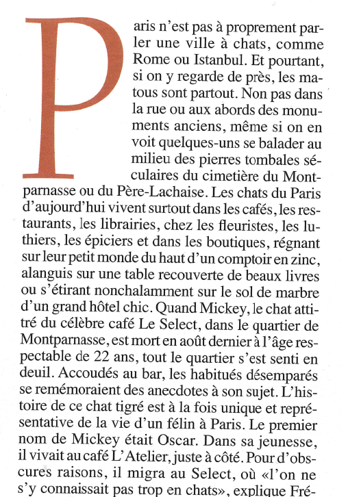

# Extraction de données textuelles depuis des images ou des enregistrements audio

## Extraction depuis des images: OCRisation

L'**OCRisation**  (OCR pour **O**ptical **C**haracter **R**ecognition) consiste à **appliquer des algorithmes de reconnaissance de caractères à des images afin d'en extraire du texte**. 

Avec R, on peut réaliser l'OCRisation à l'aide du package `tesseract`, documenté [à cette adresse](https://cran.r-project.org/web/packages/tesseract/vignettes/intro.html). Ce package repose lui-même sur (je vous le donne en mille) le logiciel Tesseract.

```{r load_tesseract}
library(tesseract)
```


Outre l'installation "classique" du package R, donc (via `install.packages("tesseract")` il peut être nécessaire de procéder "à la main" à des installations supplémentaires sur votre machine (ce sera notamment le cas si vous travaillez sous Debian/Ubuntu). Dans ce cas, je vous invite à suivre les indications sur [cette page](https://github.com/ropensci/tesseract).

En outre, pour une reconnaissance optimale des caractères, il est préférable de disposer d'un **moteur d'OCR** qui corresponde à la **langue** du texte que l'on cherche à reconnaître. Pour des langues autres que l'anglais ("eng"), il faudra donc compléter le package `tesseract` en téléchargeant le moteur adéquat. Il n'est nécessaire de réaliser ce téléchargement qu'**une seule fois**. 

Pour les **utilisateurs de Windows/MacOS**, il suffira vraisembablement de faire (ici pour le français):

```{r dl_OCR_engine_Fra, eval=FALSE}
tesseract_download("fra")
```


Pour les **utilisateurs de Debian/Ubuntu**, il peut être nécessaire au préalable pour procéder à ce téléchargement de renseigner (une seule fois!) une variable d'environnement globale TESSDATA_PREFIX en procédant comme suit:

- Ouvrir le fichier .Renviron 

```{r save_global_var, eval=FALSE}
usethis::edit_r_environ()
```

- y renseigner le chemin vers le dossier tessdata. Chez moi, il s'agit du chemin "/usr/share/tesseract-ocr/4.00/tessdata/", donc: 

```{r set_TESSDATA_PREFIX, eval=FALSE}
TESSDATA_PREFIX="/usr/share/tesseract-ocr/4.00/tessdata/"
```

Puis:

```{r dl_OCR_engine_Fra_Ubuntu, eval=FALSE}
tesseract_download("fra",datapath="/usr/share/tesseract-ocr/4.00/tessdata/")

```

### Utilisation du package `tesseract`


Considérons par exemple l'image suivante (scannée depuis un numéro Hors-Série de Géo sur les chats du monde...): 

 

Réalisons maintenant l'OCRisation à l'aide de la fonction `ocr()`:

```{r OCR_texte_brut}
texte_brut <- tesseract::ocr("images/chats_de_Paris.png",
                             engine = tesseract::tesseract("fra"))
texte_brut
```

On obtient d'ores-et-déjà un résultat intéressant, malgré quelques petites choses à nettoyer (notamment les retours à la ligne et tirets associés). Pour réaliser ce nettoyage, on peut utiliser les fonctions du package `stringr` et les expressions régulières qui font l'objet du chapitre \@ref(strings)


```{r OCR_texte_clean,tidy.opts=list(width.cutoff=60), message=FALSE, warning=FALSE}
library(dplyr)

txt=texte_brut %>% 
  stringr::str_replace_all("-\\n+","") %>% #tirets suivis de retours à la ligne simples ou multiples
  stringr::str_replace_all("\\n+"," ")     #retours à la ligne simples ou multiples
txt
```


Juste pour voir l'ensemble du texte sans avoir à scroller horizontalement:

```{r show_result}
tibtxt=tibble(txt=txt)
knitr::kable(tibtxt)
```

### Et pour OCRiser depuis un pdf??

Si vous souhaitez OCRiser depuis un pdf, vous pouvez suivre peu ou prou la démarche expliqué ci-dessus, mais en commençant par convertir votre pdf en image via le package `pdftools`:

```{r from_pdf_to_png}
pngfile <- pdftools::pdf_convert('images/geo_chats.pdf',
                                 filenames=c("docs/geo_chats.png"),
                                 dpi = 600)
print(pngfile)
```

La ligne de commande ci-dessus a ainsi créé une image "geo_chats_1.png", enregistrée localement sur le PC dans le répertoire de travail, à partir du pdf.
