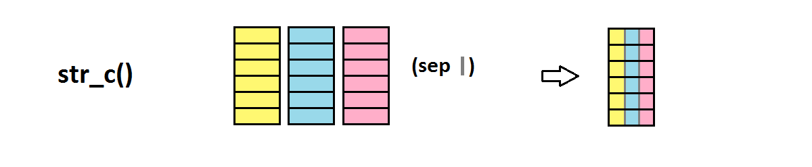
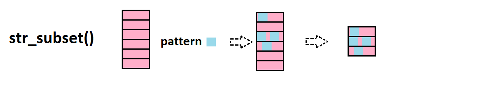
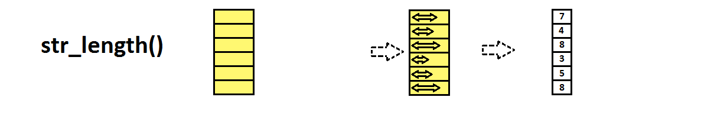

# Manipuler des strings: package stringr {#strings}

Par exemple, à l'aide du package **stringr** [@stringr]


Billet de blog [ici](http://perso.ens-lyon.fr/lise.vaudor/manipuler-des-strings-avec-r/).


## Strings

### concaténation

**str_c()** pour combiner des strings


```{r}
stringr::str_c("abra","ca","dabra")
stringr::str_c("Les jeux","de mots laids","sont pour","les gens bêtes", sep=" ")
```


### détection, remplacement

**str_detect()** détecte un pattern


```{r}
stringr::str_detect(c("Quarante","carottes","crues",
                      "croient","que","croquer",
                      "crée","des","crampes."),
                    pattern="cr")
```

**str_replace()** remplace le pattern par un autre motif


```{r}
stringr::str_replace("All we hear is Radio ga ga Radio goo goo Radio ga ga",
                     pattern="goo",
                     replacement="ga")
stringr::str_replace_all("All we hear is Radio ga ga Radio goo goo Radio ga ga",
                         pattern="goo",
                         replacement="ga")
```

Là encore, notez la différence entre str_replace() et str_replace_all()!!

### division, correspondance

**str_split()** découpe les strings partout où un pattern (ou motif) est présent

 

```{r}
stringr::str_split(c("beau_gros_chat",
                     "joli_chien",
                     "vilain_petit_canard"),
                   "_")
```

Le pattern (ici "_") peut être présent un nombre variable de fois, donc les éléments en sortie ne sont pas forcément de la même taille. C'est pourquoi cette fonction renvoie une liste.

En revanche, si l'on sait que tous les éléments de l'input seront découpés en autant de morceaux, alors on peut demander une sortie sous forme de matrice, plus pratique à manipuler par la suite, à l'aide de l'argument `simplify=TRUE`.

```{r}
stringr::str_split(c("beau_gros_chat",
                     "joli_petit_chien",
                     "vilain_petit_canard"),
                     "_",
                   simplify=TRUE)
```

Cette opération est un peu similaire à celle que réalise la fonction **str_match()**, que l'on abordera un peu plus tard...


### extraction


**str_extract()** extrait le pattern (là où il est présent)


```{r}
stringr::str_extract(c("L'âne","Trotro","trotte","à une allure",
                       "traitreusement","tranquille"),
                     pattern="tr")
```

Notez la différence entre str_extract() et str_extract_all():

```{r}
stringr::str_extract_all(c("L'âne","Trotro","trotte","à une allure",
                           "traitreusement","tranquille"),
                         pattern="tr")
```

Si un pattern est présent plusieurs fois dans un des éléments du vecteur en input, alors il correspondra à plusieurs éléments dans l'output (ainsi l'output correspond non pas à un vecteur de même taille que l'input, mais à une liste).


### comptage, subset


**str_count()** compte les occurrences d'un pattern


```{r}
stringr::str_count(c("L'âne","Trotro","trotte","à une allure","traitreusement","tranquille"),
                   pattern="tr")
```

**str_subset()** crée un subset du vecteur où le pattern est présent




```{r}
stringr::str_subset(c("Quarante","carottes","crues",
                      "croient","que","croquer",
                      "crée","des","crampes."),
                    pattern="cr")
```

### longueur, sous-partie

**str_length()** compte le nombre de caractères dans un string



```{r}
stringr::str_length("anticonstitutionnellement")
```

** str_sub()** extrait les caractères de la chaîne, de l'emplacement start à l'emplacement end


```{r}
stringr::str_sub("youpiyaya",start=1,end=5)
stringr::str_sub("youpiyaya",start=-4)
stringr::str_sub("youpiyaya",start=4)
```


## Expressions régulières

Les expressions régulières servent à effectuer des recherches de **patterns** dans les strings en définissant les **règles**  qui régissent ces patterns.[Un tuto ici](http://stringr.tidyverse.org/articles/regular-expressions.html)

.


### classes de caractères et groupes


On peut rechercher une **classe de caractères** en utilisant la notation `[...]`.

Par exemple, si je veux rechercher toutes les voyelles dans mon string:
```{r}
stringr::str_view_all("youp la boum",
                      "[aeiou]")
```

Remarquez bien la différence:

```{r}
stringr::str_view_all("A132-f445-e34-C308-M2244-Z449-E18",
                      "[308]")
stringr::str_view_all("A132-f445-e34-C308-M2244-Z449-E18",
                      "308")
```

Si l'on veut désigner un caractère quelconque, alors on peut utiliser la notation `.`.

Par exemple, si l'on souhaite rechercher n'importe quel caractère (excepté le retour à la ligne) suivi d'une lettre minuscule:

```{r}
stringr::str_view_all("32a-B44-552-98eEf",
                      ".[a-z]")
```


### caractères spéciaux 


Si je veux trouver tous les points, points d'interrogation ou points d'exclamation:
```{r}
stringr::str_view_all(c("Allô, John-John? Ici Joe la frite. Surprise!"),
                        "[\\.\\?\\!]")
```

Remarquez qu'on ne cherche pas le pattern `"[.?!]"`, mais le pattern `"[\\.\\?\\!]"`.

`.` (comme nous l'avons vu précédemment), mais aussi `?` et `!` sont des **caractères spéciaux** dans le cadre des expressions régulières. Donc, pour dire qu'on parle d'un "vrai" point, point d'interrogation ou point d'exclamation, on utilise l'escape character `\`. L'expression régulière est donc `[\.\?\!]`... 

Mais on ne s'arrête pas là... En effet, ce n'est pas *directement* une expression régulière que l'on passe à la fonction, mais plutôt une chaîne de caractères qui est elle-même "transformée" en expression régulière... Il faut donc utiliser l'escape character `\` devant les `\`. Et voilà comment on se retrouve à passer le pattern `"[\\.\\?\\!]"`.


### caractères exclus, gammes de caractères


On peut définir une classe de caractères en listant les caractères qu'elle inclut, mais également en listant **l'ensemble des caractères exclus** en utilisant la notation `[^...]`:

Par exemple, pour trouver tous les caractères qui ne sont ni une voyelle ni un espace:

```{r}
stringr::str_view_all("turlututu chapeau pointu",
                      "[^aeiou ]")
```

Enfin, on peut définir des classes de caractères correspondant à des gammes de valeurs en utilisant la notation `[...-...]`

Par exemple, pour trouver tous les chiffres entre 1 et 5:

```{r}
stringr::str_view_all(c("3 petits cochons", "101 dalmations", "7 nains"),
                      "[1-5]")
```

Pour trouver toutes les lettres entre A et F:

```{r}
stringr::str_view_all("A132-f445-e34-C308-M2244-Z449-E18",
                      "[A-F]")
```

Pour trouver toutes les lettres entre A et F et a et e:

```{r}
stringr::str_view_all("A132-f445-e34-C308-M2244-Z449-E18",
                      "[A-Fa-e]")
```


### classes prédéfinies


Notez qu'il existe des classes de caractères prédéfinies


- `\w`: un caractère alphabétique, ou un chiffre, ou un underscore `_`
- `[:alnum:]`: un caractère alphanumérique (caractère alphabétique ou chiffre)
- `[:alpha:]`: une caractère alphabétique
- `[:lower:]`: une caractère alphabétique minuscule
- `[:upper:]`: une caractère alphabétique majuscule
- `[:digit:]` (qu'on peut aussi écrire `\d`): un chiffre
- `[:punct:]`: un caractère de ponctuation
- `[:space:]`: un espace (espace simple, tabulation, tabulation verticale, nouvelle ligne, etc.)
- `[:blank:]`: un "blanc" (espace simple ou tabulation)


### quelques exemples pour bien comprendre


Une lettre entre A and E, puis un chiffre entre 1 et 6, puis un point, puis "txt":

```{r}

stringr::str_view_all(c("A2.txt","B5.png","C3.txt","E6.txt","E9.txt","F4.txt"), 
                      "[A-E][1-6]\\.txt")

```

Un chiffre suivi d'un espace:

```{r}
stringr::str_view_all(c("7 nains","3 petits cochons","101 dalmatiens"), 
                      "[0-9] ")

```

Un caractère suivi d'un chiffre suivi d'un point:

```{r}
stringr::str_view_all(c("/pouet3.kebop4.kekepwek.kwak"),
                      ".[0-9]\\.")
```

Un caractère de ponctuation suivi d'un espace simple et d'une lettre en majuscule:

```{r}
stringr::str_view_all(c("Allô? c'est John John. Tu as 5 minutes?"),
                      "[:punct:] [:upper:]")
```

### groupes et références arrières

Il est possible de créer des groupes au sein des expressions régulières, à l'aide de la notation `(...)`

Par exemple, je peux créer un premier groupe défini par une consonne suivie d'une voyelle à travers l'expression régulière `([^aeiou ][aeiou])`, et un deuxième groupe défini de la même manière.

Utilisées avec la fonction `str_match_all()`, l'usage des parenthèses permet d'isoler différentes parties du pattern:

```{r}
stringr::str_match_all(c("tili tili woup lala tutu pop"),
                       "([^aeiou ][aeiou])([^aeiou ][aeiou])")
```

L'usage conjoint des **groupes** et des **références arrières** permet par ailleurs de rechercher des **répétitions de motifs** dans les patterns.

Ainsi, pour chercher un pattern composé d'une consonne suivi d'une voyelle, répété deux fois, on peut utiliser une référence arrière `\1`, `\2`, etc. (Comme d'habitude, pour passer l'expression régulière à la fonction on utilise un string, donc on double le `\`):

```{r}
stringr::str_view_all(c("turlututu tralala"),
                      "([^aeiou ][aeiou])\\1")
```

Ici on recherche un motif (il n'y en a qu'un, donc il est numéroté "1"), répété immédiatement après sa première occurrence.

### quantificateurs

Les quantificateurs permettent de préciser le **nombre d'occurrences consécutives** d'une classe de caractères ou d'un groupe.


**zéro ou un**: On utilise la notation `?` à la suite du caractère ou motif recherché.

```{r}
stringr::str_view_all(c("file1990-fileB1990-file2005-fileAbis2005-fileA2005"),
                      "file[:alpha:]?\\d\\d\\d\\d")
```

**zéro ou plus**: On utilise la notation `*` à la suite du caractère ou motif recherché.

```{r}
stringr::str_view_all(c("fileA088-fileA-fileB-fileA862"),
                      "fileA\\d*")
```

**un ou plus** : On utilise la notation `+` à la suite du caractère ou motif recherché.

```{r}
stringr::str_view_all(c("fileA0885-fileA-fileB-fileA862"),
                      "fileA\\d+")
```

**exactement n fois**: On utilise la notation `{n}` à la suite du caractère ou motif recherché.

```{r}
stringr::str_view_all(c("fileA885.txt-fileA1506.txt-fileA1.txt-fileA862.txt"),
                      "fileA\\d{4}\\.txt")
```

**de n à m fois**

On utilise la notation `{n,m}` à la suite du caractère ou motif recherché.

```{r}
stringr::str_view_all("fileA885.txt-fileA1506.txt-fileA1.txt-fileA862.txt",
                      "fileA\\d{2,4}\\.txt")
```


### ancres et assertions avant-arrière


Les ancres permettent de **spécifier l'emplacement du motif** par rapport à un mot ou à un string.


L'ancre `^` fait référence au **début** d'un string.

```{r}
stringr::str_view_all(c("Ah! C'est toi John-John?","Ben ça alors, Joe la Frite!"),
                      "^[:upper:]") # on cherche une majuscule en début de string:
```

L'ancre `$` fait référence à la **fin** d'un string.

```{r}
stringr::str_view_all(c("Allô? John-John?"),
                      "\\?$")
```

L'ancre `\\b` fait référence au **début ou à la fin d'un mot**.

```{r}
# tous les mots se terminant par "a":
stringr::str_view_all(c("Carla Lea Armelle Marie Lisa Alexia Nina"),
                      "a\\b")

# tous les mots commençant par une majuscule:
stringr::str_view_all(c("hey Bertrand, aLLeZ vIeNs, il y aura Magda et John-John!"),
                      "\\b[:upper:]")

```


### assertions avant-arrière


Ces assertions servent à **vérifier si un motif existe dans un pattern, sans inclure ce motif dans le résultat**.


- `(?=...)`: Assertion avant 
- `(?!...)`: Assertion avant négative 
- `(?<=...)`: Assertion arrière
- `(?<!...)`: Assertion arrière négative


Exemple d'**assertion avant**: on cherche les nombres (`\b\d+\b`) qui sont suivis de " dalmatiens"

```{r}
stringr::str_view_all(c("12 labradors, 101 dalmatiens et 4 loulous"),
                      "\\b\\d+\\b(?= dalmatiens)")
```

Exemple d'**assertion avant négative**: on cherche les nombres (`\b\d+\b`) qui ne sont pas suivi de " dalmatiens"

```{r}
stringr::str_view_all("12 labradors, 101 dalmatiens et 4 loulous",
                      "\\d+\\b(?! dalmatiens)")
```

Exemple d'**assertion arrière**: on cherche les mots commençant par une majuscule (`[:upper:][:lower:]*`) précédés de "Mr ":


```{r}
stringr::str_view_all("Mr X, Mr Robot, James Bond et Jon Snow",
                      "(?<=Mr )[:upper:][:lower:]*")
```

Exemple d'**assertion arrière négative**: on cherche tous les mots commençant par une majuscule et finissant les strings (`[:upper:][:lower:]*$`) précédés par autre chose que "Mr ":

```{r}
stringr::str_view_all("Mr X, Mr Robot, James Bond et Jon Snow",
                      "(?<!Mr )[:upper:][:lower:]*$")
```

