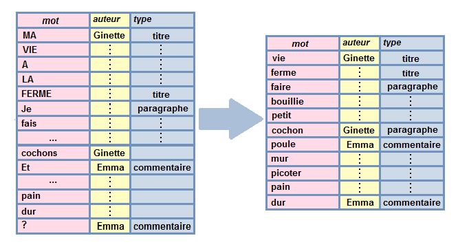

# Langage naturel


Reprenons pour cette partie la **table des commentaires** du blog fictif "Ma vie à la ferme" (présenté dans le chapitre 2). Cette table est accessible depuis [cette adresse](https://perso.ens-lyon.fr/lise.vaudor/Descriptoire/data/tibtot_commentaires.csv).


```{r}
tibtot_commentaires <- readr::read_csv("data/tibtot_commentaires.csv")
tibtot_commentaires
```

## Tokenization


On va maintenant passer à l'étape de **tokenisation** de nos textes.

Tokeniser, ça revient à définir de quelle manière on **découpe nos textes** pour les analyses ultérieures. 

Par exemple, on peut décider que l'unité d'analyse (l'individu) pour nos analyses textuelles seront un des éléments suivants:

- la **phrase**
- le **n-gram** 
- le **mot**
- etc.

Pour réaliser cette tokenisation nous allons utiliser le package `tidytext`
 et notamment sa fonction `unnest_tokens()`.


```{r, warning=FALSE, message=FALSE}
tibtot_commentaires %>% 
  tidytext::unnest_tokens(output="bigramme",
                          input=texte,
                          token="ngrams",
                          n=2)
```

```{r}
tib_mots=tibtot_commentaires %>% 
  tidytext::unnest_tokens(output="mot",
                          input=texte,
                          token="words")
tib_mots
```

## Nettoyage de la table



- retirer les **mots vides**
- extraire la **racine** des mots ou le **lemme** (**stemming**, **lemmatisation**)
- retirer la **ponctuation**
- retirer certains **mots** ou **expressions**
- changer la **casse** (passer majuscules en minuscules)
- retirer les liens, les "hashtags", les emojis, etc.
- etc.


### Nettoyage de la table par suppression des mots vides

Pour des textes en anglais, `tidytext` comprend une liste de **mots vides** ("stopwords")

```{r}
tidytext::stop_words
```

Pour un texte en français, on peut avoir recours au package `proustr` [lien ici](http://proustr.colinfay.me/)

```{r}
proustr::proust_stopwords()
```

Pour ne garder **que les mots signifiants**, on peut ainsi faire une anti-jointure entre notre table et la table renvoyée par `proust_stopwords()`:

```{r}
tib_mots_nonvides <- tib_mots %>%
  anti_join(proustr::proust_stopwords(),by=c("mot"="word"))
tib_mots_nonvides
```

### Nettoyage de la table par racinisation (stemming)

La **racinisation** (ou désuffixation, ou stemming en anglais) consiste (comme son nom l'indique) à extraire la racine d'un mot. Souvent, cette racine ne correspond pas à un "vrai mot"... 

```{r}
proustr::pr_stem_words(tib_mots_nonvides,mot)
```

### Nettoyage de la table par lemmatisation

La **lemmatisation** consiste faire correspondre à un mot (ou **forme**) la forme neutre (ou **lemme**) que ce mot aurait par exemple par défaut dans un dictionnaire.

Il est possible de lemmatiser en utilisant l'outil [TreeTagger](http://www.cis.uni-muenchen.de/~schmid/tools/TreeTagger/) (gratuit, mais propriétaire). Cet outil est utilisable dans R via le package `koRpus` [vignette ici](https://cran.r-project.org/web/packages/koRpus/vignettes/koRpus_vignette.pdf)

Pour ma part, je lemmatise la plupart du temps en me basant sur une base de données lexicales libre, [Lexique](http://www.lexique.org/telLexique.php) qui fait correspondre formes et lemmes de très nombreux mots en français. J'ai réalisé une simple jointure, sans considération *syntaxique*.


```{r}
lexique382=mixr::get_lexicon("fr")
dplyr::sample_n(lexique382,10)
```


Dans ce cas on réalise une **jointure** pour récupérer le lemme de chaque mot dans notre table:

```{r, message=FALSE, warning=FALSE}
tib_mots_nonvides <- dplyr::left_join(tib_mots_nonvides,
                                      lexique382,
                                      by=c("mot"="word"))
tib_mots_nonvides %>% 
  dplyr::select(mot,lemma)
```


```{r, echo=FALSE}
readr::write_csv(tib_mots_nonvides,"data/tib_mots_nonvides.csv")
```


