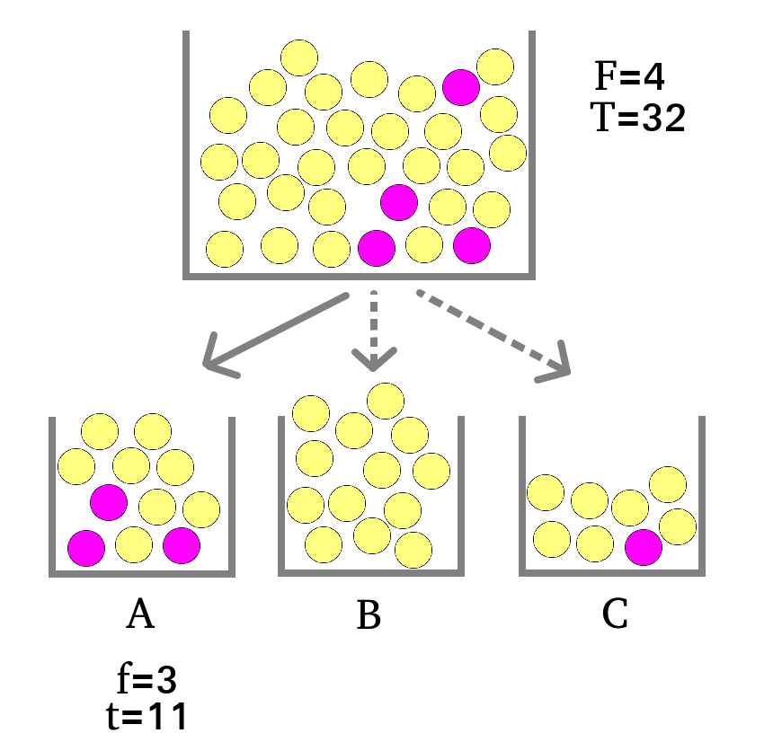

# Résumer l'information par des métriques

```{r setup, include=FALSE}
knitr::opts_chunk$set(echo = TRUE, warning=FALSE, message=FALSE)
library(tidyverse)
library(purrr)
library(rvest)
library(tidytext)
library(proustr)
library(stringr)
library(widyr)
library(mixr)
freq_mots=readRDS("data/freq_mots.RDS")
mots_cooc=readRDS("data/mots_cooc.RDS")
tib_mots_nonvides=readRDS("data/tib_mots_nonvides.RDS")
library(mixr)
```

Avant de réaliser quelques graphiques pour montrer le contenu lexical de nos textes il faudra la plupart du temps quelques calculs basiques sur nos données (par exemple **agréger** les données pour obtenir les **fréquences d'occurrence** des termes).

Pour réaliser ces quelques transformations on peut généralement utiliser les fonctions de `dplyr`.

## Corpus MinisterEco

Dans la suite de cet ouvrage, nous considérerons un nouveau *vrai* corpus de textes correspondant à l'ensemble des communiqués de presse du Ministère de la Transition écologique et de la Cohésion des territoires mis en ligne [ici](https://www.ecologie.gouv.fr/presse){target="_blank"}.

Considérons les tables suivantes, qui résultent d'un travail de récupération (par web scraping), nettoyage, tokenisation, lemmatisation de ce corpus :

```{r ministereco_data}
# Tableau des métadonnées
tib_meta <- read_csv2("data/ministereco_tib_meta.csv")
# Tableau une ligne= une occurrence de lemme
tib_lemmes <- read_csv2("data/ministereco_tib_lemmes.csv") %>% 
  na.omit() %>% 
  left_join(tib_meta, by=c("doc"))
```

Ici, on repart du tableau `tib_lemmes`.

On pourrait être amené à

- calculer la fréquence des mots
- calculer la fréquence des mots pour différentes parties du corpus
- ne garder que les $n$ mots les plus fréquents
- etc.

## Fréquences d'occurrence

Le descripteur le plus basique que l'on puisse fournir concernant les **lemmes** est leur **fréquence**. On la calcule très simplement à l'aide des fonctions de `dplyr`:

```{r freq_lemmes}
freq_lemmes <- tib_lemmes %>%
  group_by(lemma) %>% 
  summarise(freq=n()) %>% 
  arrange(desc(freq)) %>% 
  na.omit()
head(freq_lemmes)
```

Je pourrais filtrer les données de `tib_lemmes` pour ne garder qu'une fréquence minimale, ou ne garder que les $n$ mots les plus fréquents...

```{r top_freq_lemmes}
tib_lemmes_light <- tib_lemmes %>%
  group_by(lemma) %>% 
  mutate(n=n()) %>% 
  filter(n>1000) %>% 
  ungroup()
head(tib_lemmes_light)
```

Pour faciliter ce processus que l'on est amené à réaliser fréquemment pour analyser des données textuelles, j'ai créé une fonction `tidy_frequencies()` (package `mixr`) qui regroupe l'ensemble des étapes: 

```{r tidy_frequencies}
mixr::tidy_frequencies(tib_lemmes,lemma,top_freq=10)
```

## Table lexicale

Si l'on veut caractériser les **fréquences de termes** non pas dans l'absolu (dans le corpus entier) mais **selon une partition du corpus** on peut calculer la **table lexicale**:

```{r tib_lex}
tib_lex=table(tib_lemmes$lemma,tib_lemmes$ministre)
dim(tib_lex)
head(tib_lex)
```

Ici la table lexicale porte sur l'ensemble des lemmes elle a donc pour dimension 8453 lignes (le nombre de lemme distincts) x 4 colonnes (le nombre de ministres). 

La table lexicale ci-dessus permet ainsi de visualiser les **effectifs croisés** lemma * ministre. Cependant, pour toute analyse ultérieure de ces effectifs mieux vaut s'en tenir à une **mise en forme "tidy" longue**:

```{r tib_lex_long}
tib_lex_long=tib_lemmes %>% 
  group_by(lemma,ministre) %>% 
  summarise(n=n())
head(tib_lex_long)

```


## Co-occurrences, corrélations

Si l'on s'intéresse non plus seulement à la fréquence individuelle des termes mais qu'on cherche à caractériser les termes qui sont souvent employés ensemble (au sein d'un même document par exemple) on peut utiliser les fonctions du package `widyr`. 

Considérons une paire de mots: `motA` et `motB`. 
- `mot`:T (pour TRUE) correspond à l'apparition du mot
- `mot`:F (pour FALSE) correspond à la non-apparition du mot
- $N_{A=x,B=y}$ correspond à un effectif croisé des cas où `motA`:x (T ou F) et `motB`:y (T ou F)

|| `motA`:T   | `motA`:F   | Total   |
|:-----:|:--------:|:--------:|:-------:|
| `motB`:T| $N_{TT}$ | $N_{TF}$ | $N_{T.}$|
| `motB`:F| $N_{FT}$ | $N_{FF}$ | $N_{F.}$|
| Total | $N_{.T}$ | $N_{.F}$ | N       |


La **fréquence de cooccurrence** d'une paire mots correspond ainsi au **nombre de fois où ces deux mots apparaissent dans une même entité** (ci-dessous, le "doc"). En se référant au tableau ci-dessus, il s'agirait de $N_{TT}$

```{r coocurrences}
library(widyr)
mots_cooc <- tib_lemmes_light %>% 
  pairwise_count(lemma,feature=doc,sort=TRUE)

head(mots_cooc)
```

La **corrélation**, quant à elle, correspond à :

$$Cor=\frac{N_{TT}N_{FF}-N_{TF}N_{FT}}{\sqrt{N_{T.}N_{F.}N_{.F}N_{.T}}}$$


```{r correlations}
mots_cors <- tib_lemmes_light %>% 
  pairwise_cor(lemma,doc,sort=TRUE)
head(mots_cors)
```

Pour la suite on va joindre les tableaux `mots_cooc` et `mot_cors`

```{r cooccurences_et_correlations}
mots_cooc <- left_join(mots_cooc,
                       mots_cors,
                       by=c("item1","item2"))
```


```{r, echo=FALSE}
saveRDS(freq_mots,"data/freq_mots.RDS")
saveRDS(mots_cooc,"data/mots_cooc.RDS")
saveRDS(tib_mots_nonvides,"data/tib_mots_nonvides.RDS")
```

## TF-IDF

Le $TF-IDF$ (pour "**t**erm **f**requency-**i**nverse **d**ocument **f**requency") est une métrique qui reflète l'importance relative d'un mot dans un document.

- TF{d,w} est la fréquence (ou nombre d'occurrences) du terme $w$ dans le document $d$. Elle mesure l'importance du terme dans le document.
- IDF{d,w} est la fréquence inverse de document. Elle mesure l'importance du terme dans le corpus. Elle se calcule comme suit, où $D$ est le nombre total de documents et $\{d_j: w_i \in d_j\}$ est le nombre de documents qui contiennent le terme $w_i$:

$$ IDF_{w}=log\left(\frac{D}{\{d_j: w_i \in d_j\}}\right)$$ 
Le $TF-IDF$ se calcule comme le produit $TF*IDF$. La multiplication par $IDF$ sert notamment à minimiser la valeur de $TF-IDF$ pour les termes les plus fréquents, qu'on suppose peu discriminants.


```{r tfidf}
tib_tfidf <- tib_lemmes %>% 
  count(doc,lemma) %>% 
  bind_tf_idf(lemma,doc,n) %>% 
  arrange(desc(tf_idf))

head(tib_tfidf, n=15)
```


## Spécificités{#spec}

Le package `textometry` (réalisé par l'équipe TXM) comprend une fonction qui permet de calculer des scores de spécificité. Le but de ce score est (comme pour le TF-IDF) d'**identifier les termes spécifiques à une partie du corpus**.

Le modèle probabiliste associé à cet indice est expliqué [ici]
(https://txm.sourceforge.net/doc/manual/0.7.9/fr/manual59.xhtml). On peut expliquer ce modèle à travers l'image de boules et d'urnes (oui oui, comme quand on fait des probabilités au lycée...).

Considérons ainsi que **les mots dans des parties d'un texte sont assimilables à des boules dans des urnes**. On s'interroge quant à la **spécificité d'un mot particulier** -boule rose- **dans une partie du corpus** -urne A-, autrement dit on se demande si le nombre de boules roses dans l'urne A ci-dessous pourrait être due à une distribution au hasard ou si au contraire cette fréquence relativement élevée démontre que les boules roses sont "spécifiques" de cette urne.



Pour calculer les chances d'observer cette fréquence simplement par hasard, on utilise la loi de probabilité hypergéométrique. Cette loi quantifie en effet la probabilité d'effectuer un tirage sans remise de $f$ boules roses dans une urne/partie comprenant $t$ boules en tout, en tirant dans un nombre total de boules de $T$ boules dont $F$ boules roses.

Dans l'exemple ci-dessus on a:

- $f=3$ le nombre de boules roses dans A
- $t=11$ le nombre de boules dans A
- $F=4$ le nombre total de boules roses
- $T=32$ le nombre total de boules

La **probabilité dans ce contexte de tirer 11 boules et d'obtenir 3 boules roses ou plus** est de:

```{r calc_phyper}
#pr(X>=3)=1-pr(X<2)
1-phyper(q=2,m=4,n=32-4,k=11)
```
On observe donc une fréquence (3) qui n'est pas complètement improbable ($pr(X>2)\approx11$%) sous hypothèse d'une distribution au hasard des boules. En effet, par convention, on tend à considérer un événement très improbable si sa probabilité est inférieure à 5% voire 1%.


$$-log10(pr(X \geq f))$$
On obtient ainsi l'**ordre de grandeur négatif de la probabilité**:

- $-log10(0.01)=2$
- $-log10(0.001)=3$
- $-log10(0.00001)=5$
- $-log10(1e-100)=100$
- etc.

Autrement dit, **plus la fréquence est forte et improbable sous hypothèse de distribution au hasard, plus le score est élevé**, et un score $\geq$ 2 correspond à une probabilité $\leq$ 1%. C'est ainsi usuellement cette valeur seuil qu'on utilise pour considérer le score de spécificité comme étant significatif.

Les spécificités peuvent évidemment être calculées à la volée pour l'ensemble des termes (et non terme par terme comme on l'a fait ci-dessus à des fins pédagogiques). On utilise pour cela la fonction `specificities()` du [package `textometry`](https://cran.r-project.org/web/packages/textometry/index.html).

Pour **plus de compatibilité avec le tidyverse on peut utiliser la fonction `tidy_specificities()`** qui utilise la fonction du package `textometry` et reformatte la sortie de cette fonction pour renvoyer un résultat tabulaire conforme à la logique "tidyverse".


```{r tidy_specificities}
tib_spec <- mixr::tidy_specificities(tib_lemmes,lemma, ministre)
head(tib_spec)
```

```{r write_tib_spec, echo=FALSE}
write.csv2(tib_spec,"data/tib_spec.csv")
```


