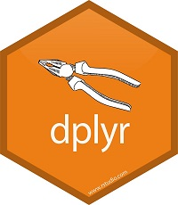

```{r setup, include=FALSE}
knitr::opts_chunk$set(echo = TRUE, warning=FALSE, message=FALSE)
library(tidyverse)
library(purrr)
library(rvest)
library(tidytext)
library(proustr)
library(widyr)
library(mixr)
```

# Résumer l'information par des métriques

Avant de réaliser quelques graphiques pour montrer le contenu lexical de nos textes il faudra la plupart du temps quelques calculs basiques sur nos données (par exemple **agréger** les données pour obtenir les **fréquences d'occurrence** des termes).

Pour réaliser ces quelques transformations on peut généralement utiliser les fonctions de `dplyr`.

Ici, on repart du tableau suivant

```{r}
tib_mots_nonvides <- read_csv("data/tib_mots_nonvides.csv") %>% 
  na.omit()
head(tib_mots_nonvides)
```

On pourrait être amené à

- calculer la fréquence des mots
- calculer la fréquence des mots pour différentes parties du corpus
- ne garder que les $n$ mots les plus fréquents
- etc.

## Fréquences d'occurrence


```{r freqmots}
freq_mots <- tib_mots_nonvides %>%
  group_by(lemma) %>% 
  summarise(freq=n()) %>% 
  arrange(desc(freq)) %>% 
  na.omit()
head(freq_mots)
```

Ici, je n'en ai pas besoin (mon jeu de données est tout petit) mais je pourrais également filtrer les données pour ne garder qu'une fréquence minimale, ou ne garder que les $n$ mots les plus fréquents...

```{r}
freq_mots %>%
  filter(freq>=5)

freq_mots %>% top_n(3,freq)
```

Pour faciliter ce processus que l'on est amené à réaliser fréquemment pour analyser des données textuelles, j'ai créé une fonction tidy_frequencies (package `mixr`) qui regroupe l'ensemble des étapes: 

```{r}
mixr::tidy_frequencies(tib_mots_nonvides,lemma,top_n=10)
```


## Co-occurrences, corrélations

Si l'on s'intéresse non plus seulement à la fréquence individuelle des termes mais qu'on cherche à caractériser les termes qui sont souvent employés ensemble (au sein d'un même commentaire par exemple) on peut utiliser les fonctions du package `widyr`. 

```{r coocurrences}
library(widyr)
mots_cooc <- tib_mots_nonvides %>%
  pairwise_count(lemma,feature=auteur,sort=TRUE) 

head(mots_cooc)
```


|| motA:T   | motA:F   | Total   |
|:-----:|:--------:|:--------:|:-------:|
| motB:T| $N_{TT}$ | $N_{TF}$ | $N_{T.}$|
| motB:F| $N_{FT}$ | $N_{FF}$ | $N_{F.}$|
| Total | $N_{.T}$ | $N_{.F}$ | N       |

$$Cor=\frac{N_{TT}N_{FF}-N_{TF}N_{FT}}{\sqrt{N_{T.}N_{F.}N_{.F}N_{.T}}}$$


```{r corrélations}
mots_cors <- tib_mots_nonvides %>% 
  pairwise_cor(lemma,auteur,sort=TRUE)
head(mots_cors)
```

Pour la suite on va joindre les tableaux `mots_cooc` et `mot_cors`

```{r}
mots_cooc <- left_join(mots_cooc,
                       mots_cors,
                       by=c("item1","item2"))
```


```{r, echo=FALSE}
saveRDS(freq_mots,"data/freq_mots.RDS")
saveRDS(mots_cooc,"data/mots_cooc.RDS")
saveRDS(tib_mots_nonvides,"data/tib_mots_nonvides.RDS")
```

## Spécificités

Le package `textometry` (réalisé par l'équipe TXM) comprend une fonction qui permet de calculer des scores de spécificité. Pour plus de compatibilité avec le tidyverse j'ai écrit une fonction `tidy_specificities()` qui reprend cette fonction et renvoie un résultat tabulaire conforme à la logique "tidyverse".

```{r}
mixr::tidy_specificities(tib_mots_nonvides,lemma, doc)
```

